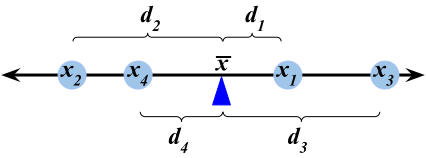

```{r setup, include=FALSE}
library(tidyverse)
library(ggthemes)
```

# Descriptive Statistics

## Structure of Data {style="font-size:28px"}

- We started by talking about the structure of data.
- We were exposed to the notion of a **data frame**, which is comprised of a series of **observational units** (i.e. rows) on a series of **variables** (i.e. columns)
- For instance, the `palmerpenguins` data frame is:

:::{.fragment}
```{r, message = F, echo = F}
#| class-output: hscroll

library(palmerpenguins)
library(tidyverse)
# penguins
cat(format(as_tibble(penguins))[-c(3L, 1L)], sep = "\n")
```

```{css, echo=FALSE}
.hscroll {
  overflow-x: auto;
  white-space: nowrap;
}
```
:::

## Structure of Data  {style="font-size:28px"}

:::{.nonincremental}
- Of course, the reader is not expected to *a priori* know what the variables in a dataset represent; as such, most datasets come equipped with a **data dictionary** that lists out the variables included in the dataset along with a brief description of each.
:::

:::{style="font-size:25px"}
| **Variable** | **Description** |
|:------------:|:---------------:|
| `species` | The species of penguin (either Adelie, Chinstrap, or Gentoo) |
| `island` | The island on which the penguin was found (either Biscoe, Dream, or Torgersen) |
| `bill_length_mm` | The length (millimeters) of the penguin's bill |
| `bill_depth_mm` | The depth (in millimeters) of the penguin's bill |
| `flipper_length_mm` | The length (in millimeters) of the penguin's flipper |
| `body_mass_g` | The mass (in grams) of the penguin |
| `sex` | The sex of the penguin (either Male or Female) |
| `year` | The year in which the penguin was observed |
:::

## Classification of Variables

- We also saw that variables fall into two main types: **numerical** and **categorical**.
    - Remember that it is not enough to simply check whether our data is comprised of numbers, as categorical data can be encoded using numbers (e.g. months in a year).
    - Rather, we should check whether it makes interpretable sense to add two elements in our variable (e.g. `1` + `2` is `3`, whereas `Jan` + `Feb` is not `March`).
    
## Classification of Variables

- Within numerical data, we have a further subdivision into **discrete** and **continuous** variables.

    - The set of possible values of a discrete variable has jumps, whereas the set possible values of a continuous variable has no jumps.
    
- Within categorical data, we have a further subdivision into **ordinal** , **nominal**, and **binary** variables.

    - Ordinal variables have a natural ordering (e.g. letter grades, months of the year, etc.) whereas nominal variables do not (e.g. favorite color). Binary variables are a special case of nominal variables with exactly two categories. 
    
## Full Classification Scheme

{width=80% fig-align="center"}


## Visualization

- Once we have classified a variable as being either numerical or categorical, we can ask ourselves: how can we best *visualize* this variable?

- For categorical data, we use a **bargraph** and for numerical data we use either a **histogram** or a **boxplot**.

## Bargraph

```{r, message = F}
library(tidyverse)
library(ggthemes)

data.frame(table(penguins$species)) %>%
  rename(species = Var1, freq = Freq) %>%
  ggplot(aes(x = species, y = freq)) +
  geom_bar(stat = "identity",
           fill = "#7f9ab5") +
  theme_economist(base_size = 18) +
  theme(panel.background = element_rect("#f0ebd8"),
        plot.background = element_rect(fill = "#f0ebd8"),
        axis.title.x = element_text(size = 16,
                                    margin = margin(
                                      t = 20, 
                                      r = 0,
                                      b = 0, 
                                      l = 0)),
        axis.title.y = element_text(size = 16)
  ) +
  ggtitle("Bargraph of Penguin Species")
```

## Histogram

```{r}
#| echo: false

penguins %>%
  ggplot(aes(x = bill_length_mm)) +
  geom_histogram(col = "white",
                 breaks = seq(30, 60, by = 5)) +
  theme_economist(base_size = 18) +
  theme(panel.background = element_rect("#f0ebd8"),
        plot.background = element_rect(fill = "#f0ebd8"),
        axis.title.y = element_text(size = 16,
                                    margin = margin(
                                      t = 0, 
                                      r = 10,
                                      b = 0, 
                                      l = 0)),
        axis.title.x = element_text(size = 16)
  ) +
  ggtitle("Distribution of Bill Lengths")

```

- Remember the importance of **binwidth**: <a href = "https://epm927.shinyapps.io/Histogram_Binwidths/" target = "_blank">demo</a>

## Boxplot

```{r}
penguins %>%
  ggplot(aes(x = bill_length_mm)) +
  stat_boxplot(geom = "errorbar", 
               width = 0.25,
               linewidth = 1) +
  geom_boxplot(fill =  "#7f9ab5", 
               linewidth = 1,
               outlier.size = 4) +
  theme_economist(base_size = 18) +
  theme(panel.background = element_rect("#f0ebd8"),
        plot.background = element_rect(fill = "#f0ebd8"),
        axis.title.y = element_text(size = 16,
                                    margin = margin(
                                      t = 0, 
                                      r = 10,
                                      b = 0, 
                                      l = 0)),
        axis.title.x = element_text(size = 16),
        axis.text.y = element_blank()
  ) +
  ylim(c(-0.75, 0.75)) +
  ggtitle("Boxplot of Bill Lengths")
```

- Remember that the **whiskers** are never allowed to extend beyond 1.5 times the **IQR** (and recall that the IQR is just the width of the box).

## Numerical Summaries {style="font-size:28px"}

- We can also produce numerical summaries of numerical variables.
- **Measures of Central Tendency** are different quantities that summarize the "center" of a variable
    - There are two main measures of central tendency we discussed: the mean and the median.

## The Mean {style="font-size:28px"}


- The **mean** (or **arithmetic mean**) is a sort of "balancing point":
    
:::{.fragment}
{width=65% fig-align="center"}
:::

:::{.fragment}
$$ \overline{x} = \frac{1}{n} \sum_{i=1}^{n} x_i $$
:::

- Also recall our discussion on **data aggregation**, and how the incorporation of new data changes the mean.

## Spread {style="font-size:28px"}

- Another way we could summarize a numerical dataset (i.e. a dataset containing only one variable, one that is numerical) is to describe how "spread out" the values are.

- The **variance** is a sort of "average distance of points to the mean":

:::{.fragment}
{width=65% fig-align="center"}
:::

:::{.fragment}
$$ s_x^2 = \frac{1}{n - 1} \sum_{i=1}^{n} (x_i - \overline{x})^2 $$
:::

- The **standard deviation** is just the square root of the variance

## Spread {style="font-size:30px"}

- The **interquartile range** (IQR) is another measure of spread:
$$ \mathrm{IQR} = Q_3 - Q_1 $$
where $Q_1$ and $Q_3$ denote the first and third **quartiles**, respectively.

    - Recall that the $p$^th^ **percentile** of a dataset $X$ is the value $\pi_{x, \ 0.5}$ such that _p_% of observations lie to the left of (i.e. are less than) $\pi_{x, \ 0.5}$. 
    
    - $Q_1$ is the 25^th^ percentile and $Q_3$ is the 75^th^ percentile
    
- The third measure of spread we discussed is the **range**:
$$ \mathrm{range}(X) = \max\{x_1, \cdots, x_n\} - \min\{x_1, \ \cdots, \ x_n\} $$

## 5-Number Summary

- Recall the **five number summary**, which contains:

    1) The minimum
    2) The first quartile
    3) The median
    4) The third quartile
    5) The maximum
    
- Also recall how all of these quantities appear on a boxplot!

## Comparisons of Variables

- If we want to compare two variables, there are three cases to consider:
    - Numerical vs. Numerical
    - Numerical vs. Categorical
    - Categorical vs. Categorical

- When comparing two numerical variables, we use a **scatterplot**
- When comparing a numerical variable to a categorical variable, we use a **side-by-side boxplot**
- When comparing two categorical variables, we construct a **contingency table**

---

:::{style="font-size:30px"}
:::: {.columns}

:::{.column width="50%"} 
- Linear **Negative** Trend:

:::{.fragment}
```{r}
set.seed(123)
x <- rnorm(100)
y <- -2 * x + rnorm(100, 0, 2)

data.frame(x, y) %>%
  ggplot(aes(x = x, y = y)) +
  geom_point(size = 4) +
  theme_economist(base_size = 24) +
  ggtitle("Y vs. X") +
  theme(panel.background = element_rect("#f0ebd8"),
        plot.background = element_rect(fill = "#f0ebd8"),
        axis.title.y = element_text(size = 16,
                                    margin = margin(
                                      t = 0, 
                                      r = 10,
                                      b = 0, 
                                      l = 0)),
        axis.title.x = element_text(size = 16,
                                    margin = margin(
                                      t = 10, 
                                      r = 0,
                                      b = 0, 
                                      l = 0)),
        title = element_text(size = 18)
  )
```
:::
:::

:::{.column width="50%"}
- Nonlinear **Negative** Trend:

:::{.fragment}
```{r}
set.seed(123)
x <- rchisq(100, 20)
y <- (1 / x^2) + rnorm(100, 0, 0.0005)

data.frame(x, y) %>%
  ggplot(aes(x = x, y = y)) +
  geom_point(size = 4) +
  theme_economist(base_size = 24) +
  ggtitle("Y vs. X") +
  theme(panel.background = element_rect("#f0ebd8"),
        plot.background = element_rect(fill = "#f0ebd8"),
        axis.title.y = element_text(size = 16,
                                    margin = margin(
                                      t = 0, 
                                      r = 10,
                                      b = 0, 
                                      l = 0)),
        axis.title.x = element_text(size = 16,
                                    margin = margin(
                                      t = 10, 
                                      r = 0,
                                      b = 0, 
                                      l = 0)),
        title = element_text(size = 18)
  )
```
:::
:::

::::


:::: {.columns}

:::{.column width="50%"} 
- Nonlinear **Positive** Trend:

:::{.fragment}
```{r}
set.seed(123)
x <- rchisq(100, 20)
y <- 1 - (1/x^2)  + rnorm(100, 0, 0.0007)

data.frame(x, y) %>%
  ggplot(aes(x = x, y = y)) +
  geom_point(size = 4) +
  theme_economist(base_size = 24) +
  ggtitle("Y vs. X") +
  theme(panel.background = element_rect("#f0ebd8"),
        plot.background = element_rect(fill = "#f0ebd8"),
        axis.title.y = element_text(size = 16,
                                    margin = margin(
                                      t = 0, 
                                      r = 10,
                                      b = 0, 
                                      l = 0)),
        axis.title.x = element_text(size = 16,
                                    margin = margin(
                                      t = 10, 
                                      r = 0,
                                      b = 0, 
                                      l = 0)),
        title = element_text(size = 18)
  )
```
:::
:::

:::{.column width="50%"}
- No Discernable Trend

:::{.fragment}
```{r}
set.seed(123)
x <- rchisq(100, 20)
y <- rchisq(100, 20)

data.frame(x, y) %>%
  ggplot(aes(x = x, y = y)) +
  geom_point(size = 4) +
  theme_economist(base_size = 24) +
  ggtitle("Y vs. X") +
  theme(panel.background = element_rect("#f0ebd8"),
        plot.background = element_rect(fill = "#f0ebd8"),
        axis.title.y = element_text(size = 16,
                                    margin = margin(
                                      t = 0, 
                                      r = 10,
                                      b = 0, 
                                      l = 0)),
        axis.title.x = element_text(size = 16,
                                    margin = margin(
                                      t = 10, 
                                      r = 0,
                                      b = 0, 
                                      l = 0)),
        title = element_text(size = 18)
  )
```
:::
:::

::::
:::

# Probability

## Basics of Probability

- Probability is, in many ways, the language of uncertainty.
- An **experiment** is any procedure we can repeat an infinite number of times, where each time we repeat the procedure the same fixed set of "things" can occur
    - These "things" are called **outcomes**
    - The **outcome space**, denoted $\Omega$, is the set containing all outcomes associated with a particular experiment.
    - **Events** are just subset of the outcome space.

- We can express outcome spaces using tables or trees.

## Probability

- **Probability** is a function that acts on events
    - Notationally: $\mathbb{P}(E)$

- There are two main approaches to computing probabilities:
    - The **Classical Aproach:** if outcomes are equally likely, then for any event $E$
    $$ \mathbb{P}(E) = \frac{\#(E)}{\#(\Omega)} $$
    - The **long-run [relative] frequency approach**: repeat the experiment an infinite number of times and define $\mathbb{P}(E)$ to be the proportion of times $E$ occurs

## Long-Run Frequencies Example {style="font-size:30px"}

| Toss | 1 | 2 | 3 | 4 | 5 | 6 | 7 | 8 | 9 | 10 |
|:----:|:--:|:--:|:--:|:--:|:--:|:--:|:--:|:--:|:--:|:--:|
| Outcome| `H` | `T` | `T` | `H` | `T` | `H` | `H` | `H` | `T` | `T` | 
| Raw freq. of `H` | 1 | 1 | 1 | 2 | 2 | 3 | 4 | 5 | 5 | 5 |
| Rel. freq of `H` | 1/1 | 1/2 | 1/3 | 2/4 | 2/5 | 3/6 | 4/7 | 5/8 | 5/9 | 5/10 |

```{r, fig.height = 3.5}
#| echo: false

library(tidyverse)
library(ggthemes)

x <- 1:10
y <- c(1, 1/2, 1/3, 2/4, 2/5, 3/6, 4/7, 5/8, 5/9, 5/10)

data.frame(x = x, y = y) %>%
  ggplot(aes(x = x, y = y)) +
  geom_point(size = 2) +
  geom_line() +
  theme_economist(base_size = 18) +
  theme(panel.background = element_rect("#f0ebd8"),
        plot.background = element_rect(fill = "#f0ebd8"),
        axis.title.y = element_text(size = 16,
                                    margin = margin(
                                      t = 0, 
                                      r = 10,
                                      b = 0, 
                                      l = 0)),
        axis.title.x = element_text(size = 16)
  ) +
  ggtitle("Relative Frequencies of Heads")
```

## Set Operations

- Given two events $E$ and $F$, there are several *operations* we can perform:
    - **Complement:** $E^\complement$; denotes "not $E$"
    - **Union:** $E \cup F$; denotes $E$ or $F$ (or both)
    - **Intersection:** $E \cap F$; denotes $E$ and $F$


## Axioms of Probability

1) $\mathbb{P}(E) \geq 0$ for any event $E$

2) $\mathbb{P}(\Omega) = 1$

3) For **disjoint events** $E$ and $F$ (i.e. for $E \cap F = \varnothing$), $\mathbb{P}(E \cup F) = \mathbb{P}(E) + \mathbb{P}(F)$

## Probability Rules

- **Probability of the Empty Set:** $\mathbb{P}(\varnothing) = 0$

- **Complement Rule:** $\mathbb{P}(E^\complement) = 1 - \mathbb{P}(E)$

- **Addition Rule:** $\mathbb{P}(E \cup F) = \mathbb{P}(E) + \mathbb{P}(F) - \mathbb{P}(E \cap F)$ 

## Conditional Probabilities {style="font-size:30px"}

- $\mathbb{P}(E \mid F)$ denotes an "updating" of our beliefs on $E$ in the presence of $F$)

    - Definition: $\displaystyle \mathbb{P}(E \mid F) = \frac{\mathbb{P}(E \cap F)}{\mathbb{P}(F)}$, provided $\mathbb{P}(F) \neq 0$

- **Multiplication Rule:** $\mathbb{P}(E \cap F) = \mathbb{P}(E \mid F) \cdot \mathbb{P}(F) = \mathbb{P}(F \mid E) \cdot \mathbb{P}(E)$

- **Bayes' Rule:** $\displaystyle \mathbb{P}(E \mid F) = \frac{\mathbb{P}(F \mid E) \cdot \mathbb{P}(E)}{\mathbb{P}(F)}$

- **Law of Total Probability:** $\mathbb{P}(F) = \mathbb{P}(F \mid E) \cdot \mathbb{P}(E) + \mathbb{P}(F \mid E^\complement) \cdot \mathbb{P}(E^\complement)$


## Independence {style="font-size:30px"}

- **Independence** asserts that $\mathbb{P}(E \mid F) = \mathbb{P}(E)$, which in turn implies $\mathbb{P}(F \mid E) = \mathbb{P}(F)$ and $\mathbb{P}(E \cap F) = \mathbb{P}(E) \cdot \mathbb{P}(F)$
     - Note that $\mathbb{P}(E \cap F) = \mathbb{P}(E) \cdot \mathbb{P}(F)$ only when $E$ and $F$ are independent! Otherwise, you have to compute $\mathbb{P}(E \cap F)$ using the multiplication rule.
     - The interpretation of independence is that the two events "do not affect each other"


# Random Variables

## Basics of Random Variables {style="font-size:32px"}

- We discussed the notion of an experiment: any procedure we can repeat an infinite number of times where each time we repeat the experiment the same fixed set of things (i.e. the *outcomes*) can occur.

- A **random variable**, loosely speaking, is some sort of numerical variable that keeps track of certain quantities relating to an experiment.

- For example, if we toss 7 coins and let $X$ denote the number of heads we observe in these 7 coin tosses, then $X$ would be a random variable.

- The set of all values a random variable can attain is called the **state space**, and is denoted $S_X$.

- We classify random variables based on their state space:
    - If $S_X$ has jumps, we say $X$ is a **discrete random variable**
    - If $S_X$ does not have jumps, we say $X$ is a **continuous random variable**

## Discrete Random Variables {style="font-size:30px"}

- Discrete random variables are described/summarized by a **probability mass function** (p.m.f.), which is a specification of the values the random variable can take (i.e. the state space) along with the probabilities with which the random variable attains those values.

    - P.M.F.'s are often displayed in tabular form: e.g.
    $$ \begin{array}{r|cccc}
      \boldsymbol{k}              & -1    & 0   & 1   & 2   \\
      \hline
      \boldsymbol{\mathbb{P}(X = k)}   & 0.1   & 0.2   & 0.3   & 0.4
    \end{array}$$
    
    - Note that the probability values in a P.M.F. must sum to 1.
    
- Quantities like $\mathbb{P}(X \leq k)$ are found by summing up the values of $\mathbb{P}(X = x)$ for all values of $x$ in the state space that are less than $k$.

    - For example, in the example above,
    $$\mathbb{P}(X \leq 0.5) = \mathbb{P}(X = -1) + \mathbb{P}(X = 0)  = 0.1 + 0.2 = 0.3 $$
    
## Expected Value {style="font-size:30px"}

- The **expected value** of a random variable $X$, denoted $\mathbb{E}[X]$, represents a sort of "average" of $X$, and is computed as
$$ \mathbb{E}[X] = \sum_{\text{all $k$}} k \cdot \mathbb{P}(X = k) $$

    - Again, don't be scared by the sigma notation! It just represents a sum.
    
    - So, for example, using our P.M.F. from the previous slide,
    \begin{align*}
      \mathbb{E}[X]   & = (-1) \cdot \mathbb{P}(X = -1) + (0) \cdot \mathbb{P}(X = 0)    \\
      & \hspace{10mm} + (1) \cdot \mathbb{P}(X = 1) + (2) \cdot \mathbb{P}(X = 2)    \\[3mm]
        & = (-1) \cdot (0.1) + (0) \cdot (0.2) + (1) \cdot (0.3) + (2) \cdot (0.4)     \\[3mm]
        & = \boxed{1}
    \end{align*}
    
## Variance and Standard Deviation {style="font-size:30px"}

- There are two formulas we can use for the **variance** of a random variable $X$:
$$ \mathrm{Var}(X) = \sum_{\text{all $k$}} (k - \mathbb{E}[X])^2 \cdot \mathbb{P}(X = k) $$
or
$$ \mathrm{Var}(X) = \left(\sum_{\text{all $k$}} k^2 \cdot \mathbb{P}(X = k) \right) - (\mathbb{E}[X])^2 $$

- The **standard deviation** of a random variable is simply the square root of the variance:
$$ \mathrm{SD}(X) = \sqrt{\mathrm{Var}(X)} $$

## Variance and Standard Deviation {style="font-size:30px"}

- For example, using the PMF from a few slides ago, the first formula for variance tells us to compute
\begin{align*}
\mathrm{Var}(X)     & = \sum_{\text{all $k$}} (k - \mathbb{E}[X])^2 \cdot \mathbb{P}(X = k)    \\
    & = (-1 - 1)^2 \cdot \mathbb{P}(X = -1) + (0 - 1)^2 \cdot \mathbb{P}(X = 0)    \\
      & \hspace{10mm} + (1 - 1)^2 \cdot \mathbb{P}(X = 1) + (2 - 1)^2 \cdot \mathbb{P}(X = 2)    \\[3mm]
        & = (-1 - 1)^2 \cdot (0.1) + (0 - 1)^2 \cdot (0.2)    \\
        & \hspace{10mm}+ (1 - 1)^2 \cdot (0.3) + (2 - 1)^2 \cdot (0.4)   \\[3mm]
        & = \boxed{1}
\end{align*}

## Variance and Standard Deviation {style="font-size:30px"}

:::{.nonincremental}
- Using the second formula for variance, we first compute
\begin{align*}
\sum_{\text{all $k$}} k^2 \mathbb{P}(X = k)    &  = (-1)^2 \cdot \mathbb{P}(X = -1) + (0)^2 \cdot \mathbb{P}(X = 0)    \\
      & \hspace{10mm} + (1)^2 \cdot \mathbb{P}(X = 1) + (2 - 1)^2 \cdot \mathbb{P}(X = 2)    \\[3mm]
        & = (-1)^2 \cdot (0.1) + (0)^2 \cdot (0.2)    \\
        & \hspace{10mm}+ (1)^2 \cdot (0.3) + (2)^2 \cdot (0.4)   \\[3mm]
        & = 2
\end{align*}
which means
$$ \mathrm{Var}(X) = 2 - (1)^2 = \boxed{1}$$
:::

## Binomial Distribution {style="font-size:32px"}

- Suppose we have $n$ independent trials, each resulting in "success" with probability $p$ and "failure" with probability $1 - p$. If $X$ denotes the number of successes in these $n$ trials, we say $X$ follow the **Binomial distribution** with parameters $n$ and $p$, notated
$$ X \sim \mathrm{Bin}(n, \ p) $$

- If $X \sim \mathrm{Bin}(n, \ p)$, then:
    - $S_X = \{0, 1, 2, \cdots, n\}$
    - $\mathbb{P}(X = k) = \binom{n}{k} p^k (1 - p)^{n - k}$
    - $\mathbb{E}[X] = np$
    - $\mathrm{Var}(X) = np(1 - p)$
  
    
## Binomial Distribution {style="font-size:32px"}

- In order to verify that the Binomial distribution is appropriate to use, we need to check the Binomial Criteria:

    1) Independence across trials
    2) Fixed number $n$  of trials
    3) Well-defined notion of "success" and "failure"
    4) Fixed probability $p$ of success across trials.
    
- If you are going to use the Binomial distribution in a problem, you **must** check **all four** of these!

