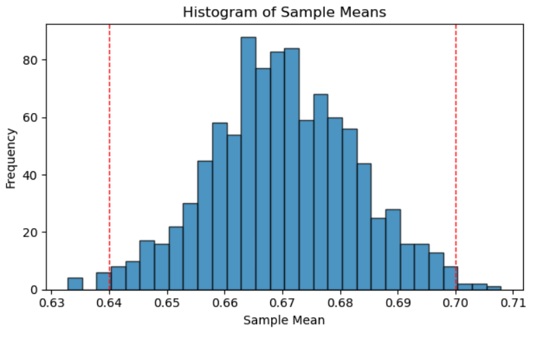

```{r setup, include=FALSE}
library(tidyverse)
library(ggthemes)
```

## Let's return to pets {style="font-size:20px"}

- According to the American Pet Products Association, prior to the pandemic, 67% of all U.S. households had pets. Many people have speculated that the rate of pet ownership changed during the pandemic. Recently, a group of veterinarians surveyed a random sample of 480 U.S. households and found that 336 had at least one pet. *Is there evidence to support the claim that the rate of pet ownership now differs from the 67% before the pandemic?*

:::{style="text-align:center"}
{width="60%"}
:::


## Hypothesis Testing {style="font-size:30px"}

- This is the framework of **Hypothesis Testing**

- In hypothesis testing, we start with a pair of competing claims which we call the **null hypothesis** and **alternative hypothesis**, respectively. 

    - We use $H_0$, read as "h-naught", to denote the null hypothesis and $H_A$ to denote the alternative hypothesis.

- For instance, in our pets example above the null hypothesis would be "$H_0$: the true proportion of US households with pets is 67\%". 

- Oftentimes we will want to phrase our hypotheses in more mathematical terms. This is where the notation we've used over the past few lectures comes into play: letting $p$ denote the true proportion of US households with pets, we can write our null hypothesis as
$$ H_0: \ p = 0.67 $$ 

## Hypothesis Testing {style="font-size:30px"}

- What about the alternative hypothesis?

- As the name suggests, the alternative hypothesis provides some sort of alternative to the null.

- Let's look at our pet example again. Here are some potential alternatives to the null:
    - $p \neq 0.67$ (the true proportion of US households with pets is not 67\%)
    - $p > 0.67$ (the true proportion of US households with pets is larger than 67\%)
    - $p < 0.67$ (the true proportion of US households with pets is less than 67\%)
    - $p = 0.33.5$ (the true proportion of US households with pets is 33.5\%)


## Hypothesis Testing {style="font-size:28px"}

- Each of these alternative hypotheses has a name.
- Before we talk about these names, let's establish a slightly more general framework for conducting hypothesis testing on a proportion. 

- Our null hypothesis will often take the form
$$ H_0 : \ p = p_0 $$
for some prespecified value $p_0$ (e.g. 67\%, like in our pet example above).

- This leads to four possible alternative hypotheses:
    - $H_A: \ p \neq p_0$
    - $H_A: \ p > p_0$ 
    - $H_A: \ p < p_0$
    - $H_A: \ p = p_1$ (where $p_1 \neq p_0$)

- I'd like to stress: in a specific hypothesis testing problem, [we need to pick *one* of these alternative hypotheses]{.underline}

## Terminology {style="font-size:28px"}

- When our alternative hypothesis is of the form $H_A: \ p \neq p_0$, we refer to the situation as a **two-sided** hypothesis test.

- When our alternative hypothesis is of the form $H_A: \ p > p_0$ or $H_A: \ p < p_0$, we refer to the situation as a **one-sided** hypothesis test. Specifically:

    - $H_A: \ p < p_0$ leads to a **lower-tailed test**
    - $H_A: \ p > p_0$ leads to an **upper-tailed test**

- When our alternative hypothesis is of the form $H_A: \ p = p_1$ (for some value $p_1$ different than our **null value** $p_0$), we refer to the situation as a **simple-vs-simple** hypothesis test.

- Again, our test will be only *one* of the above!
- Additionally, it is usually up to the tester (i.e. the statistician or datascientist in charge of conducting the hypothesis test) to pick which set of hypotheses to use.

## Setting the Hypotheses {style="font-size:28px"}

- Okay, so which test to we use when?

- In practice, there isn't a one-size-fits-all approach to knowing which set of hypotheses to adapt in a given situation.

- Usually, in the absence of any additional information, we adopt a two-sided test as it tends to be the most general. 

- However, sometimes additional information may be available to us that may influence us to select a different type of test.

    - For example, if previous studies have resulted in numerous observed sample proportions much less than the null value $p_0$, we may want to adopt a lower-tailed test.

- How do we set the null hypothesis? Well, typically the null hypothesis is easier to set: I like to think of it as the "status quo".

    - In other words, the null hypothesis is often taken to be whatever the existing claims state; e.g. that 67\% of US households have pets.


## Worked-Out Example
:::{.fragment}
::: callout-tip
## Worked-Out Example 1

:::{.nonincremental}
::: {style="font-size: 28px"}
*Forbes* magazine has claimed that, as of May 2023, 91.7\% of US households own a vehicle. To test this, we took a representative sample of 500 US households. 

a. What is the population?
b. What is the sample?
c. Define the parameter of interest.
d. Define the random variable of interest.
e. Write down the null hypothesis for this test.
f. Write down the two-sided alternative hypothesis for this test.
g. Write down the lower-tailed alternative hypothesis for this test.
h. Write down the upper-tailed alternative hypothesis for this test.

:::
:::
:::
:::

## Solutions {style="font-size:32px"}

a. The population is the set of all US households.
b. The sample is the representative sample of 500 US households we took.
c. The parameter of interest is $p =$ the true proportion of US households that own a vehicle.
d. The random variable of interest is $\widehat{P} =$ the proportion of households in a sample of 500 that own a vehicle.
e. Recall that the null hypothesis can be thought of as the "status quo". 
    - In other words, we take the null to be whatever claim we want to test:
$$ H_0 : \ p = 0.917 $$

## Solutions (cont'd) {style="font-size:32px"}

f. The two-sided alternative hypothesis would be that the proportion of households that own a vehicle is *not equal to* 91.7\%:
$$ H_A: \ p \neq 0.917 $$
g. The lower-tailed alternative hypothesis would be that the proportion of households that own a vehicle is *less than* 91.7\%:
$$ H_A: \ p < 0.917 $$

h. The lower-tailed alternative hypothesis would be that the proportion of households that own a vehicle is *greater than* 91.7\%:
$$ H_A: \ p > 0.917 $$


## Hypothesis Testing {style="font-size:30px"}

- Alright, here is what we have so far in terms of hypotheses:
    - The **null hypothesis** represents a sort of "status quo" statement.
    - The **alternative hypothesis** represents an alternative to the status quo.
  
- So, what is a hypothesis *test*?

- A **hypothesis test** is a framework/procedure that allows us to determine whether or not the null should be rejected in favor of the alternative.

- Naturally, a hypothesis test will depend on *data*! As such, we can think of a hypothesis test as a *function* that takes in data and outputs either `reject H0` or `fail to reject H0`.
$$ \texttt{decision}(\texttt{data}) = \begin{cases} \texttt{reject } H_0 & \text{if } \texttt{...} \\  \texttt{fail to reject } H_0 & \text{if } \texttt{...} \\ \end{cases}  $$


## Fail To Reject? {style="font-size:28px"}

- By the way, the results of a hypothesis test are always framed in terms of the null hypothesis; e.g. "reject $H_0$" or "fail to reject $H_0$".

- Wait, why are we saying "fail to reject $H_0$"? Isn't that just equivalent to "accept $H_0$"?

- Well, not quite...

- Think of it this way: just because we are saying the particular alternative hypothesis we picked is less plausible than the null, doesn't mean there isn't a *different* alternative hypothesis that is more plausible than the null.

- All we are saying when we fail to reject the null is exactly that- we didn't have enough information to reject $H_0$ outright. We are *not* saying that $H_0$ must be true.

    
## Four States of the World {style="font-size:30px"}

- Okay, so we've talked a bit more about what a hypothesis test actually is: it is a procedure that takes in data and outputs a *decision* on whether or not to reject the null.

- Behind the scenes, however, the null will either be true or not.

- This leads to the following four situations:

:::{.fragment}
<table>
  <tr>
    <td style="border: 0px solid black;"></td>
    <td style="border: 0px solid black;"></td>
    <td colspan="2" padding-left:10px; background-color: #c4eef2; style="text-align: center"><b>Result of Test</b></td>
  </tr>
  <tr>
    <td style="border: 0px solid black;"></td>
    <td style="border: 0px solid black;"></td>
    <td style="border: 1px solid black; padding-right:10px;  padding-left:10px; width:5cm; text-align: center"><b>Reject</b></td>
    <td style="border: 1px solid black; padding-right:10px;  padding-left:10px; width:5cm; text-align: center"><b>Fail to Reject</b></td>
  </tr>
  <tr>
    <td style="border: 0px solid black; text-align: center; vertical-align: middle;" rowspan="2"><b><i>H</i><sub>0</sub></b></td>
    <td style="border: 0px solid black;"><b>True</b></td>
    <td style="border: 1px solid black; padding-right:10px;  padding-left:10px; text-align:center; color:red"></td>
    <td style="border: 1px solid black; padding-right:10px;  padding-left:10px; text-align:center"></td>
  </tr>
  <tr>
    <td style="border: 0px solid black;"><b>False</b></td>
    <td style="border: 1px solid black; padding-right:10px;  padding-left:10px; text-align:center"></td>
    <td style="border: 1px solid black; padding-right:10px;  padding-left:10px; text-align:center"></td>
  </tr>
  
</table>
:::
  
\

- Some of these situations are good, and some of these are bad! Which are which?
   
## Four States of the World {style="font-size:30px"}

\

<table>
  <tr>
    <td style="border: 0px solid black;"></td>
    <td style="border: 0px solid black;"></td>
    <td colspan="2" padding-left:10px; background-color: #c4eef2; style="text-align: center"><b>Result of Test</b></td>
  </tr>
  <tr>
    <td style="border: 0px solid black;"></td>
    <td style="border: 0px solid black;"></td>
    <td style="border: 1px solid black; padding-right:10px;  padding-left:10px; width:5cm; text-align: center"><b>Reject</b></td>
    <td style="border: 1px solid black; padding-right:10px;  padding-left:10px; width:5cm; text-align: center"><b>Fail to Reject</b></td>
  </tr>
  <tr>
    <td style="border: 0px solid black; text-align: center; vertical-align: middle;" rowspan="2"><b><i>H</i><sub>0</sub></b></td>
    <td style="border: 0px solid black;"><b>True</b></td>
    <td style="border: 1px solid black; padding-right:10px;  padding-left:10px; text-align:center; color:red"><b>BAD</b></td>
    <td style="border: 1px solid black; padding-right:10px;  padding-left:10px; text-align:center; color:green"><b>GOOD</b></td>
  </tr>
  <tr>
    <td style="border: 0px solid black;"><b>False</b></td>
    <td style="border: 1px solid black; padding-right:10px;  padding-left:10px; text-align:center; color:green"><b>GOOD</b></td>
    <td style="border: 1px solid black; padding-right:10px;  padding-left:10px; text-align:center; color:red"><b>BAD</b></td>
  </tr>
  
</table>

\

- We give names to the two "bad" situations: **Type I** and **Type II** errors.

:::{.fragment}
<table>
  <tr>
    <td style="border: 0px solid black;"></td>
    <td style="border: 0px solid black;"></td>
    <td colspan="2" padding-left:10px; background-color: #c4eef2; style="text-align: center"><b>Result of Test</b></td>
  </tr>
  <tr>
    <td style="border: 0px solid black;"></td>
    <td style="border: 0px solid black;"></td>
    <td style="border: 1px solid black; padding-right:10px;  padding-left:10px; width:5cm; text-align: center"><b>Reject</b></td>
    <td style="border: 1px solid black; padding-right:10px;  padding-left:10px; width:5cm; text-align: center"><b>Fail to Reject</b></td>
  </tr>
  <tr>
    <td style="border: 0px solid black; text-align: center; vertical-align: middle;" rowspan="2"><b><i>H</i><sub>0</sub></b></td>
    <td style="border: 0px solid black;"><b>True</b></td>
    <td style="border: 1px solid black; padding-right:10px;  padding-left:10px; text-align:center; color:red"><b>Type I Error</b></td>
    <td style="border: 1px solid black; padding-right:10px;  padding-left:10px; text-align:center; color:green"><b>GOOD</b></td>
  </tr>
  <tr>
    <td style="border: 0px solid black;"><b>False</b></td>
    <td style="border: 1px solid black; padding-right:10px;  padding-left:10px; text-align:center; color:green"><b>GOOD</b></td>
    <td style="border: 1px solid black; padding-right:10px;  padding-left:10px; text-align:center; color:red"><b>Type II Error</b></td>
  </tr>
  
</table>
:::

## Type I and Type II Errors {style="font-size:30px"}

:::{.fragment}
::: callout-note
## **Definition:** Type I and Type II errors

:::{.nonincremental}
::: {style="font-size: 25px"}
- A **Type I Error** occurs when we reject $H_0$, when $H_0$ was actually true. 
- A **Type II Error** occurs when we fail to reject $H_0$, when $H_0$ was actually false.
:::
:::
:::
:::

- A common way of interpreting Type I and Type II errors are in the context of the judicial system.

- The US judicial system is built upon a motto of "innocent until proven guilty." As such, the null hypothesis is that a given person is innocent.

- A Type I error represents convicting an innocent person.

- A Type II error represents letting a guilty person go free.


## Type I and Type II Errors {style="font-size:30px"}

- Viewing the two errors in the context of the judicial system also highlights a tradeoff.

- If we want to reduce the number of times we wrongfully convict an innocent person, we may want to make the conditions for convicting someone even stronger.

- But, this would have the consequence of having fewer people overall convicted, thereby (and inadvertently) *increasing* the chance we let a guilty person go free.

- As such, [controlling for one type of error increses the likelihood of committing the other type.]{.underline}

## Worked-Out Example
:::{.fragment}
::: callout-tip
## Worked-Out Example 2

:::{.nonincremental}
::: {style="font-size: 28px"}
*Forbes* magazine has claimed that, as of May 2023, 91.7\% of US households own a vehicle.

Assuming we are conducting a two-sided test, what would a Type I error be in the context of this experiment? What about a Type II error?

:::
:::
:::
:::


## Solutions {style="font-size:32px"}

- A Type I error would be concluding that the true proportion of US households that own a vehicle is not 91.7\%, when in fact 91.7\% of US households own a vehicle.

- A Type II error would be concluding that the true proportion of US households that own a vehicle is 91.7\%, when in fact the true proportion is *not* 91.7\%. 

# Constructing Tests for a Proportion

## Leadup {style="font-size:30px"}

- Alright, now we know about the basics and background surrounding hypothesis tests.

- How do we actually *construct* one?

- Let's focus on hypothesis testing for population proportions for now; we'll deal with sample means later.

- Recall our setup: our hypothesis test should be some sort of decision-making process of the form
$$ \texttt{decision}(\texttt{data}) = \begin{cases} \texttt{reject } H_0 & \text{if } \texttt{...} \\  \texttt{fail to reject } H_0 & \text{if } \texttt{...} \\ \end{cases}  $$

## Leadup {style="font-size:30px"}

- For the moment, let's return to the pet example from the beginning of the lecture.

- Letting $p$ denote the true proportion of US household with pets, our null hypothesis takes the form $H_0: \ p = 0.67$. 

- Suppose we take a two-sided alternative: $H_A: \ p \neq 0.67$. 

- As such, our decision process should probably be of the form
$$ \texttt{decision}(\widehat{p}) = \begin{cases} \texttt{reject } H_0 & \text{if } \texttt{...} \\  \texttt{fail to reject } H_0 & \text{if } \texttt{...} \\ \end{cases}  $$

- If we observe a value of $\widehat{p} = 0.82$, or a value of $\widehat{p} = 0.001$, we would likely be inclined to reject the null.


## Test Statistic {style="font-size:30px"}

- So, it makes sense to reject $H_0$ when $\widehat{p}$ is very far away from $p_0$ (which, in the pet example, is $0.67$).
$$ \texttt{decision}(\widehat{p}) = \begin{cases} \texttt{reject } H_0 & \text{if $\widehat{p}$ is far from $p_0$} \\  \texttt{fail to reject } H_0 & \text{otherwise}\\ \end{cases}  $$

- For reasons that will become clear in a few slides, we typically avoid using $\widehat{p}$ and instead use a *standardized* version of $\widehat{p}$:
$$ \mathrm{ts} = \frac{\widehat{p} - p_0}{\sqrt{\frac{p_0 (1 - p_0)}{n}}} $$
where $\mathrm{ts}$ stands for **test statistic**.


## Test Statistic {style="font-size:30px"}

- Let's try and convert our decision-making process to be in terms of the test statistic.

- First, note that saying $\widehat{p}$ is "far away" from $p_0$ could mean one of two things:
    - $\widehat{p}$ was *much larger* than $p_0$
    - $\widehat{p}$ was *much smaller* than $p_0$

- These two cases can be combined into a single case if we think in terms of the magnitude of the distance bewteen $\widehat{p}$ and $p_0$, which is equivalent to considering $|\mathrm{ts}|$.

- What I'm getting at is this: if $\widehat{p}$ was far away from $p_0$, then $|\mathrm{ts}|$ must be large.

- Hence, we can rephrase our decision process as
$$ \texttt{decision}(\mathrm{TS}) = \begin{cases} \texttt{reject } H_0 & \text{if $|\mathrm{TS}|$ is large} \\  \texttt{fail to reject } H_0 & \text{otherwise}\\ \end{cases}  $$

## Constructing the Test {style="font-size:30px"}

- Okay, but how large is "large"?

- That is, for what values of $|\mathrm{TS}|$ will we reject the null?
    - By the way, the set of values that correspond to a decision of `reject` is called the **rejection region** of a test.

- In other words, if our test takes the form
$$ \texttt{decision}(\mathrm{TS}) = \begin{cases} \texttt{reject } H_0 & \text{if } |\mathrm{TS}| > c \\ \texttt{fail to reject } H_0 & \text{otherwise}\\ \end{cases}  $$
what value should we take $c$ to be?

## The Errors {style="font-size:30px"}

- Well, to answer this question, we need to return to our considerations of Type II and Type II errors. 

- Recall that a Type I error occurs when we reject $H_0$ when $H_0$ was actually true, and a Type II error occurs when we fail to reject $H_0$ when $H_0$ was false. 

- Changing the value of $c$ changes the probability of committing the two types of errors!

- Specifically, setting a larger value of $c$ corresponds to rejecting $H_0$ for *fewer* values, thereby *decreasing* the probability of committing a Type I errror but *increasing* the probability of committing a Type II error.

- Conversely, setting a smaller value of $c$ corresponds to rejecting $H_0$ for *more* values, thereby *increasing* the probability of committing a Type I error but *decreasing* the probability of committing a Type II error.


## How to pick our value of c 

- We can determine our critical value (c) by two main factors: 
1. The significance level ($\alpha$) : This is the probability of rejecting the null hypothesis when it is actually true ( Type I error!). Common values are $\alpha = .05, .01,.10$. A lower $\alpha$ means we have a lower probability of making an Type 1 error, requiring stronger evidence to reject the null
2. The type of test (one tailed vs two tailed)
- Once we know $\alpha$ and our type of test, we can find c! 

## How to pick our value of c

- Assuming the null is true (i.e. that $p = p_0$), the Central Limit Theorem for Proportions tells us
$$ \widehat{P} \stackrel{H_0}{\sim} \mathcal{N}\left(p_0, \ \sqrt{\frac{p_0(1 - p_0)}{n}} \right) $$
where the symbol $\stackrel{H_0}{\sim}$ is just a shorthand for "distributed as, under the null"

- Since our random variable follows the standard normal distribution, we can apply the symmetry of the standard normal distribution to find c: 

  - c = $(-1)  (\frac{\alpha}{2})* 100^{th} percentile$ **or** c = $(1 - \frac{\alpha}{2})* 100^{th} percentile$


## The Test {style="font-size:30px"}

:::{.fragment}
::: callout-important
## **Two-Sided Test for a Proportion:**

:::{.nonincremental}
::: {style="font-size: 25px"}
When testing $H_0: \ p = p_0$ vs $H_A: \ p \neq p_0$ at an $\alpha$ level of significance, where $p$ denotes a population proportion, the test takes the form
$$ \texttt{decision}(\mathrm{TS}) = \begin{cases} \texttt{reject } H_0 & \text{if } |\mathrm{TS}| > z_{1 - \alpha/2} \\ \texttt{fail to reject } H_0 & \text{otherwise}\\ \end{cases}  $$
where:

- $\displaystyle \mathrm{TS} = \frac{\widehat{p} - p_0}{\sqrt{\frac{p_0(1 - p_0)}{n}}}$

- $z_{1 - \alpha/2}$ denotes the $(\alpha/2) \times 100$^th^ percentile of the standard normal distribution, scaled by negative 1 (which is equivalent to the $(1 - \alpha/2) \times 100$^th^ percentile)

provided that: $n p_0 \geq 10$ and $n (1 - p_0) \geq 10$.
:::
:::
:::
:::

## The Test {style="font-size:30px"}


- For example, if $\alpha = 0.05$ then $c$ is negative 1 times the 2.5^th^ percentile of the standard normal distribution; i.e. 1.96 and our test becomes
$$ \texttt{decision}(\mathrm{TS}) = \begin{cases} \texttt{reject } H_0 & \text{if } |\mathrm{TS}| > 1.96 \\ \texttt{fail to reject } H_0 & \text{otherwise}\\ \end{cases}  $$


:::{.fragment style="color:red; font-size:40px"}
**CAUTION!!!**
:::

- All of this is predicated on our invocation of the Central Limit Theorem for Proportions! 

- In other words, the test above was derived assuming
$$ \widehat{P} \stackrel{H_0}{\sim} \mathcal{N}\left(p_0, \ \sqrt{\frac{p_0(1 - p)}{n}} \right) $$


## The Assumptions {style="font-size:30px"}

:::{.nonincremental}
- This is not always true!
:::

- When is this true? In other words, what conditions do we need in order for the above distributional statement to be true?
    - That's right, the success-failure conditions.

- But now, since we only need the above to be true for $p = p_0$, we only need to verify that:
    1) $n p_0 \geq 10$
    2) $n (1 - p_0) \geq 10$

- It is very important we check these conditions before conducting our test!


## The Test {style="font-size:30px"}

:::{.fragment}
::: callout-important
## **Two-Sided Test for a Proportion:**

::: {style="font-size: 25px"}
When testing $H_0: \ p = p_0$ vs $H_A: \ p \neq p_0$ at an $\alpha$ level of significance, where $p$ denotes a population proportion:

1) Check that the success-failure conditions hold. Namely, check that:
    - $n p_0 \geq 10$
    - $n (1 - p_0) \geq 10$

2) Compute the observed value of the test statistic $$\displaystyle \mathrm{ts} = \frac{\widehat{p} - p_0}{\sqrt{\frac{p_0(1 - p_0)}{n}}}$$

3) Compute the **critical value** $z_{1 - \alpha/2}$, which is the the $(\alpha/2) \times 100$^th^ percentile of the standard normal distribution, scaled by negative 1 (or simply the $(1 - \alpha/2) \times 100$^th^ percentile)

4) `Reject` $H_0$ if $|\mathrm{TS}| > z_{1 - \alpha/2}$, and `fail to reject` $H_0$ otherwise.
:::
:::
:::


## Worked-Out Example
:::{.fragment}
::: callout-tip
## Worked-Out Example 3

:::{.nonincremental}
::: {style="font-size: 28px"}
*Forbes* magazine has claimed that, as of May 2023, 91.7\% of US households own a vehicle. To test that claim, we take a representative sample of 500 US households and observe that 89.4\% of these households own a vehicle.

Conduct a two-sided hypothesis test at a $5\%$ level of significance on *Forbes*'s claim that 91.7\% of US households own a vehicle. Be sure you phrase your conclusion clearly, and in the context of the problem.
:::
:::
:::
:::

## Solutions {style="font-size:28px"}

- All we really need to do is follow the steps outlined in the previous slide.

1) **Check Conditions**

    - $n p_0 = 500 \cdot (0.917) = 458.5 \geq 10 \ \checkmark$
    - $n (1 - p_0) = 500 \cdot (1 - 0.917) = 41.5 \geq 10 \ \checkmark$
    
    - Since both conditions are met, we can proceed.

2) **Compute the Observed Value of the Test Statistic** $$ \mathrm{ts} = \frac{\widehat{p} - p_0}{\sqrt{\frac{p_0 (1 - p_0)}{n}}} = \frac{0.894 - 0.917}{\sqrt{\frac{0.917 (1 - 0.917)}{500}}} = -1.86 $$

3) **Compute the critical value** Because $\alpha = 0.05$, the critical value is $1.96$.

## Solutions {style="font-size:30px"}

4) **Conduct the test:** We see that $|\mathrm{TS}| = |-1.86| = 1.86$ which is *not* greater than $1.96$. As such, we **fail to reject the null**.

- Now, the problem told us to phrase our conclusions carefully and in the context of the problem.

- It is **VERY** important to include the level of significance in your final conclusions.

- So, here is how we would phrase the final conclusion of our test:

:::{.fragment}
> At an $\alpha = 0.05$ level of significance, we do not have enough evidence to reject the null hypothesis that 91.7\% of US households own a vehicle. Thus, our analysis suggests that the true proportion of US households with vehicle is not different from 91.7\%. 
:::

## Alternatively

:::{.fragment}
> At an $\alpha = 0.05$ level of significance, there is insufficient evidence to reject Forbes’s claim that 91.7\% of US households own a vehicle in favor of the alternative that the true proportion of US households that own a vehicle is not 91.7\%.
:::

- It is very important to include the level of significance in our conclusion! This is because the final outcome of our test may change depending on which level of significance we use.


## Worked-Out Example
:::{.fragment}
::: callout-tip
## Worked-Out Example 4

:::{.nonincremental}
::: {style="font-size: 28px"}
*Forbes* magazine has claimed that, as of May 2023, 91.7\% of US households own a vehicle. To test that claim, we take a representative sample of 500 US households and observe that 89.4\% of these households own a vehicle.

Conduct a two-sided hypothesis test at a $10\%$ level of significance on *Forbes*'s claim that 91.7\% of US households own a vehicle. Be sure you phrase your conclusion clearly, and in the context of the problem.
:::
:::
:::
:::


## Solutions {style="font-size:30px"}

- The only thing that will change from before is our critical value. 

- Since we are using an $\alpha = 0.1$ level of significance, we find the $[1 - (0.1 / 2)] \times 100$^th^ percentile (which is equivalent to the $(0.1 / 2) \times 100$^th^ percentile, scaled by negative 1).

- There are several ways we could find this critical value. 

- The first is to use our normal table: $1.645$.
- The second is to use our $t-$table: $1.645$
- The third is to use Python:

:::{.fragment}
```{python}
#| echo: True

import scipy.stats as sps
-sps.norm.ppf(0.1 / 2)
```
:::

## Solutions (cont'd) {style="font-size:30px"}

- Hence, we adopt a critical value of $1.645$.

- Since the observed value of our test statistic $|\mathrm{ts}| = 1.86$ is now larger than the critical value, we **reject** the null.

:::{.fragment}
> At an $\alpha = 0.1$ level of significance, there is evidence to reject *Forbes*'s claim that 91.7\% of US households own a vehicle in favor of the alternative that the true proportion of households that own a vehicle is not 91.7\%.
:::

- Intuitively, it makes sense why we might reject for this new level of significance.

- We know that the level of significance represents the probability of committing a Type I Error.

- If we increase this value (which we did, in adopting $\alpha = 0.1$ as opposed to $\alpha = 0.05$ in the previous example), we are allowing a greater chance of falsely rejecting the null, which comes part-in-parcel with rejecting for more values of the test statistic.


## Lower-Tailed Test

:::{.fragment}
::: callout-important
## **Lower-Tailed Test for a Proportion:**

:::{.nonincremental}
::: {style="font-size: 25px"}
When testing $H_0: \ p = p_0$ vs $H_A: \ p < p_0$ at an $\alpha$ level of significance, where $p$ denotes a population proportion, the test takes the form
$$ \texttt{decision}(\mathrm{TS}) = \begin{cases} \texttt{reject } H_0 & \text{if } \mathrm{TS} < z_{\alpha} \\ \texttt{fail to reject } H_0 & \text{otherwise}\\ \end{cases}  $$
where:

- $\displaystyle \mathrm{TS} = \frac{\widehat{p} - p_0}{\sqrt{\frac{p_0(1 - p_0)}{n}}}$

- $z_{\alpha}$ denotes the $(\alpha) \times 100$^th^ percentile of the standard normal distribution, **not scaled by anything**

provided that: $n p_0 \geq 10$ and $n (1 - p_0) \geq 10$.
:::
:::
:::
:::


## Upper-Tailed Test

:::{.fragment}
::: callout-important
## **Upper-Tailed Test for a Proportion:**

:::{.nonincremental}
::: {style="font-size: 25px"}
When testing $H_0: \ p = p_0$ vs $H_A: \ p > p_0$ at an $\alpha$ level of significance, where $p$ denotes a population proportion, the test takes the form
$$ \texttt{decision}(\mathrm{TS}) = \begin{cases} \texttt{reject } H_0 & \text{if } \mathrm{TS} > z_{1 - \alpha} \\ \texttt{fail to reject } H_0 & \text{otherwise}\\ \end{cases}  $$
where:

- $\displaystyle \mathrm{TS} = \frac{\widehat{p} - p_0}{\sqrt{\frac{p_0(1 - p_0)}{n}}}$

- $z_{1 - \alpha}$ denotes the $(1 - \alpha) \times 100$^th^ percentile of the standard normal distribution, **not scaled by anything**

provided that: $n p_0 \geq 10$ and $n (1 - p_0) \geq 10$.
:::
:::
:::
:::

## Note

- I don't recommend you try and memorize all of the different percentiles and critical values.

- Instead, I recommend you familiarize yourself with the process used to derive these tests, as that will immediately tell you what picture to draw, which will in turn tell you which quantile we are after in a given situation.

