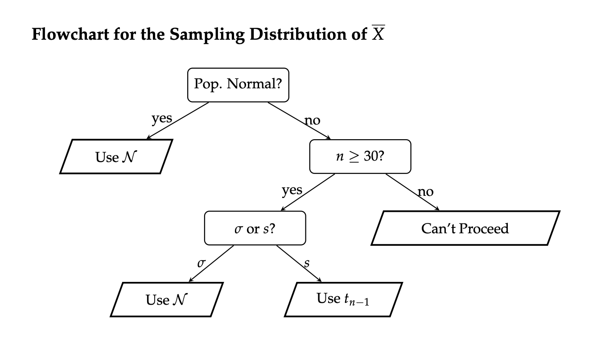

```{r setup, include=FALSE}
library(tidyverse)
library(ggthemes)
```

# Random Variables


## Continuous Random Variables {style="font-size:32px"}

- Not all random variables are discrete- many are continuous!
- Continuous random variables are characterized by a **probability density function** (pdf) $f_X(x)$, which must obey the following two properties:
    1) $f_X(x)$ must be nonnegative everywhere
    2) The area underneath the graph of $f_X(x)$ must be 1

- The graph of a pdf is called a **density curve**
- Probabilities are found as areas underneath the density curve.

## Areas Under the Density Curve {style="font-size:32px"}

\

```{r, fig = T, fig.align = 'center', fig.width = 7, fig.height = 4}
#| echo: False

f <- function(x){
  0.3 * dbeta(x, 2, 6) + 0.7 * dbeta(x, 6, 2)
}

x <- seq(0, 1, by = 0.1)
data.frame(x) %>% ggplot(aes(x = x)) +
  stat_function(fun = f,
                xlim = c(0.25, 0.75),
                geom = "area",
                fill = "#a4caeb") +
  stat_function(fun = f,
                size = 1) +
  theme_economist_white() +
  theme(
    panel.background = element_rect("#f0ebd8"),
    plot.background = element_rect(fill = "#f0ebd8")
  ) +
  xlab("") +
  ylab("") 
```

- For example, the area above represents $\mathbb{P}(0.25 \leq X \leq 0.75)$.

## Uniform Distribution {style="font-size:32px"}

- An specific example of a continuous distribution is the **Uniform distribution** with parameters $a$ and $b$: $X \sim \mathrm{Unif}(a, \ b)$.

- The p.d.f. is given by
$$ f_X(x) = \begin{cases} \frac{1}{b - a} & \text{if } a \leq x \leq b \\ 0 & \text{otherwise} \\ \end{cases} $$

:::{.fragment style="text-align:center"}
{width="60%"}
:::


## Uniform Distribution {style="font-size:32px"}

- The expected value and variance are:
$$ \mathbb{E}[X] = \frac{a + b}{2} ; \quad \mathrm{Var}(X) = \frac{(b - a)^2}{12} $$

- Again, probabilities are found as areas underneath the density curve:

:::{.fragment}
```{r}
#| fig.height = 3,
#| fig.width = 7,
#| fig.align = 'center'

ggplot(data.frame(x = c(-0.5, 1.5)), aes(x)) +
  stat_function(fun = dunif,
                args = list(0, 1),
                xlim = c(0.25, 0.75),
                geom = "area",
                fill = "#a4caeb",
                n = 250) +
  stat_function(fun = dunif,
                args = list(0, 1),
                size = 1.5,
                n = 250) +
  theme_economist_white() +
  theme(
    panel.background = element_rect("#f0ebd8"),
    plot.background = element_rect(fill = "#f0ebd8")
  ) +
  xlab("") +
  ylab("") +
  ylim(c(0, 1.25)) +
  scale_x_continuous(breaks = round(
    seq(-0.5, 1.5, by = 0.5), 
    1)
  ) +
  theme(plot.margin = margin(-1, 0, 0, 0, "cm"))

```
:::

## Tail Probabilities {style="font-size:26px"}

- Visualizing probabilities as areas also enables us to write more complicated probabilistic expressions as differences of tail probabilities:


::::{.columns}

:::{.column width="30%"}
\
:::

:::{.column width="40%"}
:::{.fragment}
```{r}
#| fig.height = 3,
#| fig.width = 7,
#| fig.align = 'center'

f <- function(x){
  0.3 * dbeta(x, 2, 6) + 0.7 * dbeta(x, 6, 2)
}

x <- seq(0, 1, by = 0.1)
data.frame(x) %>% ggplot(aes(x = x)) +
  stat_function(fun = f,
                xlim = c(0.12, 0.85),
                geom = "area",
                fill = "#a4caeb") +
  stat_function(fun = f,
                size = 1) +
  theme_economist_white() +
  theme(
    panel.background = element_rect("#f0ebd8"),
    plot.background = element_rect(fill = "#f0ebd8")
  ) +
  xlab("") +
  ylab("")  
```
:::
:::


:::{.column width="30%"}
:::{.fragment}
\
can be decomposed as
:::
:::

::::


::::{.columns}

:::{.column width="40%"}
:::{.fragment}
```{r}
#| fig.height = 3,
#| fig.width = 7,
#| fig.align = 'center'

f <- function(x){
  0.3 * dbeta(x, 2, 6) + 0.7 * dbeta(x, 6, 2)
}

x <- seq(0, 1, by = 0.1)
data.frame(x) %>% ggplot(aes(x = x)) +
  stat_function(fun = f,
                xlim = c(0, 0.85),
                geom = "area",
                fill = "#a4caeb") +
  stat_function(fun = f,
                size = 1) +
  theme_economist_white() +
  theme(
    panel.background = element_rect("#f0ebd8"),
    plot.background = element_rect(fill = "#f0ebd8")
  ) +
  xlab("") +
  ylab("")  
```
:::
:::


:::{.column width="20%"}
:::{.fragment}
\
$$ \huge - $$
:::
:::

:::{.column width="40%"}
:::{.fragment}
```{r}
#| fig.height = 3,
#| fig.width = 7,
#| fig.align = 'center'

f <- function(x){
  0.3 * dbeta(x, 2, 6) + 0.7 * dbeta(x, 6, 2)
}

x <- seq(0, 1, by = 0.1)
data.frame(x) %>% ggplot(aes(x = x)) +
  stat_function(fun = f,
                xlim = c(0, 0.12),
                geom = "area",
                fill = "#a4caeb") +
  stat_function(fun = f,
                size = 1) +
  theme_economist_white() +
  theme(
    panel.background = element_rect("#f0ebd8"),
    plot.background = element_rect(fill = "#f0ebd8")
  ) +
  xlab("") +
  ylab("")  
```
:::
:::

::::

:::{.fragment}
$$ \mathbb{P}(a \leq X \leq b) = \underbrace{\mathbb{P}(X \leq b)}_{\text{c.d.f. at $b$}} - \underbrace{\mathbb{P}(X \leq a)}_{\text{c.d.f. at $a$}} $$
:::


## Chalkboard Example

:::{.fragment}
::: callout-tip
## Chalkboard Example 2

:::{.nonincremental}
::: {style="font-size: 30px"}
The time (in minutes) spent waiting in line at *Starbucks* is found to vary uniformly between 5mins and 15mins.

A random sample of 10 customers is taken; what is the probability that exactly 4 of these customers will spend between 10 and 13 minutes waiting in line?
:::
:::
:::
:::

## Normal Distribution {style="font-size:30px"}

- We also learned about the **Normal Distribution**: $X \sim \mathcal{N}(\mu, \ \sigma)$

- The normal density curve is bell-shaped


## Standardization {style="font-size:30px"}

- If $X \sim \mathcal{N}(\mu, \ \sigma)$,
$$ \left( \frac{X - \mu}{\sigma} \right) \sim \mathcal{N}(0, \ 1)$$

\

- Also, if $X \sim \mathcal{N}(\mu, \ \sigma)$:
    - $\mathbb{E}[X] = \mu$
    - $\mathrm{Var}(X) = \sigma^2$
    

# Inferential Statistics

## Inferential Statistics {style="font-size:30px"}

- The primary goal of inferential statistics is to take samples from some **population**, and use **summary statistics** to try and make **inferences** about **population parameters**

- For example, we could take samples, compute **sample proportions $\widehat{P}$**, and try to make inferences about the **population proportion** $p$.

- We could also take samples, compute **sample means $\overline{X}$**, and try to make inferences about the **population mean** $\mu$.

- Our summary statistics will often be **point estimators** (i.e. quantities that have expected value equal to the corresponding population parameter), which are *random variables* as they depend on the sample taken.

    - For example, different samples of people will have different average heights.
    
- The distribution of a point estimator is called the **sampling distribution** of the estimator.

## Sampling Distribution of $\widehat{P}$ {style="font-size:28px"}

- Given a population with population proportion $p$, we use $\widehat{P}$ as a point estimator of $p$.

- Assume the **success-failure conditions** are met; i.e.
    1) $n p \geq 10$
    2) $n (1 - p) \geq 10$
  
- Then, the **Central Limit Theorem for Proportions** tells us that
$$ \widehat{P} \sim \mathcal{N}\left(p, \ \sqrt{\frac{p(1 - p)}{n}} \right) $$

- If we don't have access to $p$ directly (as is often the case), we use the **substitution approximation** to check whether
    1) $n \widehat{p} \geq 10$
    2) $n (1 - \widehat{p}) \geq 10$

## Sampling Distribution of $\overline{X}$ {style="font-size:24px"}

- Given a population with population mean $\mu$ and population standard deviation $\sigma$, we use $\overline{X}$ as a point estimator of $\mu$.

- If the population is normally distributed, then 
$$ \overline{X} \sim \mathcal{N}\left(\mu, \ \frac{\sigma}{\sqrt{n}} \right) $$
or, equivalently,
$$ \frac{\overline{X} - \mu}{\sigma / \sqrt{n}} \sim \mathcal{N}\left(0, \ 1 \right) $$

- If the population is *not* normally distributed, but the sample size $n$ is at least 30, then the **Central Limit Theorem for the Sample Mean** (or just the **Central Limit Theorem**) tells us
$$ \frac{\overline{X} - \mu}{\sigma / \sqrt{n}} \sim \mathcal{N}\left(0, \ 1 \right) $$


## Sampling Distribution of $\overline{X}$ {style="font-size:24px"}

- If the population is non-normal, the sample size is large, and we don't have access to $\sigma$ (but access to $s$, the sample standard deviation instead), then
$$ \frac{\overline{X} - \mu}{s / \sqrt{n}} \sim t_{n - 1}$$

- Recall that the $t-$distribution *looks* like a standard normal distribution, but has wider tails than the standard normal distribution (which accounts for the additional uncertainty injected into the problem by using $s$, a random variable, in place of $\sigma$, a deterministic constant).

- Also recall that $t_{\infty}$ (i.e. the $t-$distribution with an infinite **degrees of freedom**) is the same thing as the standard normal distribution.

## Confidence Intervals {style="font-size:30px"}

- Instead of using point estimators (which are random) to estimate population parameters (which are deterministic), it may make more sense to provide an *interval* that, with some **confidence level**, contains the true parameter value.

- In general, when constructing a confidence interval for a parameter $\theta$, we use
$$ \widehat{\theta} \pm c \cdot \mathrm{SD}(\widehat{\theta}) $$
where $c$ is some constant that depends on our confidence level.

    - Again, think of the fishing analogy from the textbook- if we want to be *more certain* we'll catch a fish, we should cast a *wider* net; i.e. higher confidence levels will lead to *wider* intervals.
    
- The coefficient $c$ will also depend on the sampling distribution of $\widehat{\theta}$.

## Confidence Intervals for a Population Proportion {style="font-size:30px"}

- To construct a confidence interval for an unknown population proportion $p$, we use
$$ \widehat{p} \pm (c) \cdot \sqrt{\frac{\widehat{p} \cdot (1 - \widehat{p})}{n}} $$
where $c$ denotes the $(1 - \alpha) / 2 \times 100$^th^ percentile of the standard normal distribution, scaled by negative 1
    - Again, just remember that the coefficient should be positive

## Confidence Intervals for a Population Mean {style="font-size:30px"}

- To construct a confidence interval for an unknown population mean $\mu$, we use
$$ \overline{x} \pm (z^{\ast}) \cdot \frac{\sigma}{\sqrt{n}} $$
or
$$ \overline{x} \pm (t^{\ast}) \cdot \frac{s}{\sqrt{n}} $$
depending on the conditions listed in the previous section of these slides.


## Worked-Out Example {style="font-size:30px"}

:::{.fragment}
::: callout-tip
## Worked-Out Example 3

:::{.nonincremental}
::: {style="font-size: 30px"}
Saoirse would like to construct a 95\% confidence interval for the true proportion of California Residents that speak Spanish. To that end, she took a representative sample of 120 CA residents and found that 36 of these residents speak Spanish.

a. Identify the population
b. Define the parameter of interest.
c. Define the random variable of interest.
e. Construct a 95\% confidence interval for the true proportion of CA residents that speak Spanish.
:::
:::
:::
:::

## Solutions {style="font-size:30px"}

a. The population is the set of all California residents.

b. The parameter of interest is $p$, the true proportion of CA residents that speak Spanish.

c. The random variable of interest is $\widehat{P}$, the proportion of people in a representative sample of 120 CA residents that speak spanish.

e. We check the success-failure conditions, with the substitution approximation:
    - $n \widehat{p} = (120) \cdot \left( \frac{36}{120} \right) = 36 \ \checkmark$
    - $n (1 - \widehat{p}) = (120) \cdot \left( \frac{84}{120} \right) = 84 \ \checkmark$
    
- Since these conditions are met, we can proceed in constructing our confidence interval as
$$ 0.3 \pm 1.96 \cdot \sqrt{\frac{0.3 \cdot 0.7}{120}} = \boxed{[0.218 \ , \ 0.382]} $$


# Hypothesis Testing

## Hypothesis Testing {style="font-size:32px"}

- Recall that in the framework of **hypothesis testing**, we wish to utilize *data* to assess the plausibility/validity of a **hypothesis**, called the **null hypothesis**.

    - Specifically, we wish to determine whether or not the data provides support to reject the null in favor of the **alternative hypothesis** or not.

- In the case of hypothesis testing for a population proportion $p$, our null takes the form $H_0: p = p_0$ and there are several different alternative hypotheses we could consider:

    - **Two-tailed alternative/test:** $H_A: \ p \neq p_0$
    - **Lower-tailed alternative/test:** $H_A: \ p < p_0$
    - **Upper-tailed alternative/test:** $H_A: \ p > p_0$


## Two-Sided Test for a Proportion {style="font-size:30px"}

:::{.fragment}
::: callout-important
## **Two-Sided Test for a Proportion:**

:::{.nonincremental}
::: {style="font-size: 25px"}
When testing $H_0: \ p = p_0$ vs $H_A: \ p \neq p_0$ at an $\alpha$ level of significance, where $p$ denotes a population proportion, the test takes the form
$$ \texttt{decision}(\mathrm{TS}) = \begin{cases} \texttt{reject } H_0 & \text{if } |\mathrm{TS}| > z_{1 - \alpha/2} \\ \texttt{fail to reject } H_0 & \text{otherwise}\\ \end{cases}  $$
where:

- $\displaystyle \mathrm{TS} = \frac{\widehat{p} - p_0}{\sqrt{\frac{p_0(1 - p_0)}{n}}}$

- $z_{1 - \alpha/2}$ denotes the $(\alpha/2) \times 100$^th^ percentile of the standard normal distribution, scaled by negative 1 (which is equivalent to the $(1 - \alpha/2) \times 100$^th^ percentile)

provided that: $n p_0 \geq 10$ and $n (1 - p_0) \geq 10$.
:::
:::
:::
:::

## Lower-Tailed Test

:::{.fragment}
::: callout-important
## **Lower-Tailed Test for a Proportion:**

:::{.nonincremental}
::: {style="font-size: 25px"}
When testing $H_0: \ p = p_0$ vs $H_A: \ p < p_0$ at an $\alpha$ level of significance, where $p$ denotes a population proportion, the test takes the form
$$ \texttt{decision}(\mathrm{TS}) = \begin{cases} \texttt{reject } H_0 & \text{if } \mathrm{TS} < z_{\alpha} \\ \texttt{fail to reject } H_0 & \text{otherwise}\\ \end{cases}  $$
where:

- $\displaystyle \mathrm{TS} = \frac{\widehat{p} - p_0}{\sqrt{\frac{p_0(1 - p_0)}{n}}}$

- $z_{\alpha}$ denotes the $(\alpha) \times 100$^th^ percentile of the standard normal distribution, **not scaled by anything**

provided that: $n p_0 \geq 10$ and $n (1 - p_0) \geq 10$.
:::
:::
:::
:::


## Upper-Tailed Test

:::{.fragment}
::: callout-important
## **Upper-Tailed Test for a Proportion:**

:::{.nonincremental}
::: {style="font-size: 25px"}
When testing $H_0: \ p = p_0$ vs $H_A: \ p > p_0$ at an $\alpha$ level of significance, where $p$ denotes a population proportion, the test takes the form
$$ \texttt{decision}(\mathrm{TS}) = \begin{cases} \texttt{reject } H_0 & \text{if } \mathrm{TS} > z_{1 - \alpha} \\ \texttt{fail to reject } H_0 & \text{otherwise}\\ \end{cases}  $$
where:

- $\displaystyle \mathrm{TS} = \frac{\widehat{p} - p_0}{\sqrt{\frac{p_0(1 - p_0)}{n}}}$

- $z_{1 - \alpha}$ denotes the $(1 - \alpha) \times 100$^th^ percentile of the standard normal distribution, **not scaled by anything**

provided that: $n p_0 \geq 10$ and $n (1 - p_0) \geq 10$.
:::
:::
:::
:::


## Worked-Out Example {style="font-size:30px"}

:::{.fragment}
::: callout-tip
## Worked-Out Example 4

:::{.nonincremental}
::: {style="font-size: 28px"}
Administration within a Statistics department at an unnamed university claims to admit 24\% of all applicants. A disgruntled student, dubious of the administration's claims, takes a representative sample of 120 students who applied to the Statistics major, and found that 20\% of these students were actually admitted into the major. \

Conduct a two-sided hypothesis test at a 5\% level of significance on the administrator's claims that 24\% of applicants into the Statistics major are admitted. Be sure you phrase your conclusion clearly, and in the context of the problem.
:::
:::
:::
:::

## Solutions {style="font-size:30px"}

- We first phrase the hypotheses.

- Let $p$ denote the true proportion of applicants who get admitted into the major. Since we are performing a two-sided test, our hypotheses take the form
$$ \left[ \begin{array}{rr}
  H_0:    p = 0.24    \\
  H_A:    p \neq 0.24
\end{array} \right.$$

- Now we compute the observed value of the test statistic:
$$ \mathrm{ts} = \frac{\widehat{p} - p_0}{\sqrt{\frac{p_0(1 - p_0)}{n}}} = \frac{0.2 - 0.24}{\sqrt{\frac{(0.24) \cdot (1 - 0.24)}{120}}} \approx -1.026 $$

- Next, we compute the critical value. Since we are using an $\alpha = 0.05$ level of significance, we will use the critical value $1.96$

## Solutions {style="font-size:30px"}

- Finally, we perform the test: we will reject the null in favor of the alternative if $|\mathrm{ts}|$ is larger than the critical value.

- In this case, $|\mathrm{ts}| = |-1.026| = 1.026 < 1.96$ meaning we fail to reject the null:

:::{.fragment}
> At an $\alpha = 0.05$ level of significance, there was insufficient evidence to reject the null hypothesis that 24\% of applicants are admitted into the major in favor of the alternative that the true admittance rate was *not* 24\%.
:::


## Hypothesis Testing for Mean {style="font-size:32px"}

Similar to test for proportions, we also have the following alternatives:

  - A **two-sided alternative** is $H_A: \ \mu \neq \mu_0$
  - A **lower-tailed alternative** is $H_A: \ \mu < \mu_0$
  - An **upper-tailed alternative** is $H_A: \ \mu > \mu_0$

## Conditions to Check for Hypothesis Testing for Mean {style="font-size:32px"}

We want to check the following conditions:



## Test Statistics for Hypothesis Testing for Mean {style="font-size:32px"}

$$ \mathrm{TS} = \begin{cases}
  \displaystyle \frac{\overline{X} - \mu_0}{\sigma / \sqrt{n}}    & \text{if } \quad  \begin{array}{rl} \bullet & \text{pop. is normal, OR} \\ \bullet & \text{$n \geq 30$ AND $\sigma$ is known} \end{array} \quad \stackrel{H_0}{\sim} \mathcal{N}(0, \ 1) \\[5mm]
  \displaystyle \frac{\overline{X} - \mu_0}{s / \sqrt{n}}         & \text{if } \quad  \begin{array}{rl} \bullet & \text{$n \geq 30$ AND $\sigma$ is not known} \end{array} \quad \stackrel{H_0}{\sim} t_{n - 1}
\end{cases} $$

## Test Statistic for Two-Sided Hypothesis Testing for Mean {style="font-size:32px"}

- Our test in the two-sided case will then take the form
$$ \texttt{decision}(\mathrm{TS}) = \begin{cases} \texttt{reject } H_0 & \text{if } |\mathrm{TS}| > c \\ \texttt{fail to reject } H_0 & \text{otherwise}\\ \end{cases}  $$

## Test Statistic for One-Sided Hypothesis Testing for Mean {style="font-size:32px"}

- Analogously as with the hypothesis testing for proportions, the lower-tailed test of a population mean takes the form
$$ \texttt{decision}(\mathrm{TS}) = \begin{cases} \texttt{reject } H_0 & \text{if } \mathrm{TS} < c \\ \texttt{fail to reject } H_0 & \text{otherwise}\\ \end{cases}  $$
and the upper-tailed test of a population mean takes the form
$$ \texttt{decision}(\mathrm{TS}) = \begin{cases} \texttt{reject } H_0 & \text{if } \mathrm{TS} > c \\ \texttt{fail to reject } H_0 & \text{otherwise}\\ \end{cases}  $$

## P-Value {style="font-size:32px"}

- We also talked about p-value: the probability of obtaining a value of the statistic as extreme or more extreme as the observed statistic when the null hypothesis is true. 

- When the p-value is small, we have evidence that our observed results are unlikely to have occurred by chance alone when the null hypothesis is true. The smaller the p-value, the stronger the evidence is against the null hypothesis.

  - Small p-value suggest that we have results that are inconsistent with the null hypothesis and that the null should be rejected.
  
  - Large p-value suggest that we have results that are not inconsistent with the null hypothesis and that null should not be rejected. 

## P-Value {style="font-size:32px"}

  
|                       | Decision              |
|-----------------------|:----------------------|
| p-value $\leq \alpha$ | Reject $H_0$          |    
| p-value $> \alpha$    | Fail to reject $H_0$  |


