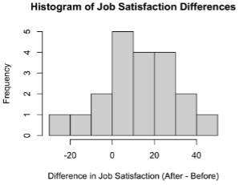

```{r setup, include=FALSE}
library(tidyverse)
library(ggthemes)
```


## Reminders
- Quiz 4 today!! 
- Extra credit Homework released on Friday and due next Wednesday 
- Exam next Thursday! Need calculator and Access Card


## Warm up {style="font-size:30px"}

:::{.fragment}
::: callout-tip
## Warm Up #1

:::{.nonincremental}
::: {style="font-size: 30px"}
Melanie would like to construct a 95\% confidence interval for the true proportion of California Residents that speak Spanish. To that end, she took a representative sample of 120 CA residents and found that 36 of these residents speak Spanish.

a. Identify the population
b. Define the parameter of interest.
c. Define the random variable of interest.
e. Construct a 95\% confidence interval for the true proportion of CA residents that speak Spanish.

```{r}
countdown::countdown(
  minutes = 3,
  # left = 0, right = 0,
  # Fanfare when it's over
  play_sound = TRUE,
  color_border              = "#FFFFFF",
  color_text                = "#7aa81e",
  color_running_background  = "#7aa81e",
  color_running_text        = "#FFFFFF",
  color_finished_background = "#ffa07a",
  color_finished_text       = "#FFFFFF",
  font_size = "2em",
  )
```

:::
:::
:::
:::

## Solutions {style="font-size:30px"}

a. The population is the set of all California residents.

b. The parameter of interest is $p$, the true proportion of CA residents that speak Spanish.

c. The random variable of interest is $\widehat{P}$, the proportion of people in a representative sample of 120 CA residents that speak spanish.

e. We check the success-failure conditions, with the substitution approximation:
    - $n \widehat{p} = (120) \cdot \left( \frac{36}{120} \right) = 36 \ \checkmark$
    - $n (1 - \widehat{p}) = (120) \cdot \left( \frac{84}{120} \right) = 84 \ \checkmark$
    
- Since these conditions are met, we can proceed in constructing our confidence interval as
$$ 0.3 \pm 1.96 \cdot \sqrt{\frac{0.3 \cdot 0.7}{120}} = \boxed{[0.218 \ , \ 0.382]} $$


## Warm Up {style="font-size:30px"}
:::{.fragment}
::: callout-tip
## Warm Up # 2

:::{.nonincremental}
::: {style="font-size: 28px"}
Administration within a Statistics department at an unnamed university claims to admit 24\% of all applicants. A disgruntled student, dubious of the administration's claims, takes a representative sample of 120 students who applied to the Statistics major, and found that 20\% of these students were actually admitted into the major. \

Conduct a two-sided hypothesis test at a 5\% level of significance on the administrator's claims that 24\% of applicants into the Statistics major are admitted. Be sure you phrase your conclusion clearly, and in the context of the problem.


```{r}
countdown::countdown(
  minutes = 2,
  # left = 0, right = 0,
  # Fanfare when it's over
  play_sound = TRUE,
  color_border              = "#FFFFFF",
  color_text                = "#7aa81e",
  color_running_background  = "#7aa81e",
  color_running_text        = "#FFFFFF",
  color_finished_background = "#ffa07a",
  color_finished_text       = "#FFFFFF",
  font_size = "2em",
  )
```

:::
:::
:::
:::

## Solutions {style="font-size:30px"}

- We first phrase the hypotheses.

- Let $p$ denote the true proportion of applicants who get admitted into the major. Since we are performing a two-sided test, our hypotheses take the form
$$ \left[ \begin{array}{rr}
  H_0:    p = 0.24    \\
  H_A:    p \neq 0.24
\end{array} \right.$$

- Now we compute the observed value of the test statistic:
$$ \mathrm{ts} = \frac{\widehat{p} - p_0}{\sqrt{\frac{p_0(1 - p_0)}{n}}} = \frac{0.2 - 0.24}{\sqrt{\frac{(0.24) \cdot (1 - 0.24)}{120}}} \approx -1.026 $$

- Next, we compute the critical value. Since we are using an $\alpha = 0.05$ level of significance, we will use the critical value $1.96$

## Solutions {style="font-size:30px"}

- Finally, we perform the test: we will reject the null in favor of the alternative if $|\mathrm{ts}|$ is larger than the critical value.

- In this case, $|\mathrm{ts}| = |-1.026| = 1.026 < 1.96$ meaning we fail to reject the null:

- We can also solve this using a p value! $$\mathbb{P}(TS \leq -1.026) = .1539$$. We will reject the null if  $$p\ value < \alpha$$. 

- Since we are using a two sided alternative test, our p value = 2 * .1539 = .3078. .3078 > .05, so once again we fail to reject the null. 

:::{.fragment}
> At an $\alpha = 0.05$ level of significance, there was insufficient evidence to reject the null hypothesis that 24\% of applicants are admitted into the major in favor of the alternative that the true admittance rate was *not* 24\%.
:::


## Paired Data

- Data are **paired** when each observation in one data set corresponds to exactly one observation in the other data set. This can happen when there are two measurements on each individual in the sample or when there is a natural pairing between the samples (e.g., siblings, spouses, days of the week).

- “Studies leading to paired data are often more efficient—better able to detect differences between conditions—because you have controlled for a source of variation (individual variability among the observational units).”

- With paired data, we have two measurements on each pair. Instead of being interested in the two measurements separately, we are interested in the differences within each pair. What may originally look like two data sets is actually just one data set of differences.


## Example {style="font-size:32px"}

- The Comprehensive Assessment of Outcomes in Statistics (CAOS) test was developed by statistics education researchers to be “a reliable assessment consisting of a set of items that students completing any introductory statistics course would be expected to understand.” When doing research about a particular teaching method, Professor Miller had students take the CAOS test at the beginning of the term (pretest) and at the end of the term (posttest). Why does it make sense to treat these measurements as paired data?

  - By examining the differences between the pretest and posttest measurements, we eliminate the variability across different students and focus in on that improvement measure (the difference between the posttest and pretest scores) itself: we have controlled for one source of variation (variability within each student).


## Paired Data Procedures {style="font-size:32px"}

Once we compute the set of differences, we use our one-sample methods for inference. Our notation changes to indicate that we are working with differences.

- Our parameter of interest is $\mu_d$, the population mean of the differences.

- The point estimate for $\mu_d$ is $\bar{x}_d$, the sample mean of the differences.

## Sampling Distribution of the Sample Mean of the Differences $\bar{x}_d$ {style="font-size:32px"}

The sampling distribution of $\bar{x}_d$ will be approximately normal when the following two conditions are met:

1. **Independence**: The observations within the sample of differences are independent (e.g., the differences are a random sample from the population of differences).

2. **Normality**: When the sample is small, we require that the sample of differences comes from a population with a nearly normal distribution.
Thanks to the Central Limit Theorem, we can relax this condition more and more for larger and larger sample sizes.


## Sampling Distribution of the Sample Mean of the Differences $\bar{x}_d$ {style="font-size:32px"}

The mean for sampling distribution of $\bar{x}_d$ is $\mu_d$. The standard error for this sampling distribution is 

$$\frac{\sigma_d}{\sqrt{n}}$$
where $\sigma_d$ is the standard deviation of the population of differences and $n$ is the number of pairs.

## Sampling Distribution of the Sample Mean of the Differences $\bar{x}_d$ {style="font-size:32px"}

- Since we do not usually know the population standard deviation of the differences $\sigma_d$, we estimate it with the sample standard deviation of the differences $s_d$.

- As soon as we estimate the population standard deviation $\sigma_d$ with the sample standard deviation $s_d$, we need to switch from the standard normal N(0, 1) distribution to a $t$ distribution.


## Hypothesis Test for $\mu_d$

Based on a sample of $n$ independent differences from a nearly normal distribution, the test statistic is

$$ts = \frac{\bar{x}_d -\mu_0}{\frac{s_d}{\sqrt{n}}}$$
where $\bar{x}_d$ is the sample mean of the differences, $s_d$ is the sample standard deviation of the differences, $n$ is the sample size (number of pairs), and $\mu_0$ corresponds to the null value of the population mean of the differences, $\mu_d$.

We use the $t$ distribution with $n-1$ degrees of freedom to calculate our p-values. 

## Confidence Interval for $\mu_d$

Based on a sample of $n$ independent differences from a nearly normal distribution, a confidence interval for the population mean of the differences $\mu_d$ is 

$$\bar{x}_d \pm t^* \frac{s_d}{\sqrt{n}}$$

where $\bar{x}_d$ is the sample mean of the differences, $s_d$ is the sample standard deviation of the differences, n is the sample size, and $t^*$ corresponds to the confidence level and n-1 degrees of freedom. 

## Worked-Out Example {style="font-size:32px"}

:::{.fragment}
::: callout-tip
## Worked-Out Example 1

:::{.nonincremental}
::: {style="font-size: 28px"}

A company institutes an exercise break for its workers to see if this will *improve* job satisfaction, as measured by a questionnaire that assesses workers’ satisfaction. A random sample of 50 workers was taken. Each worker was given the questionnaire twice: once prior to the implementation of the exercise break; a second time after the implementation of the exercise break. The differences in job satisfaction (satisfaction after implementation of the exercise program minus satisfaction before implementation of the exercise program) were calculated, and the mean of the difference is calculated to be 11.727 and standard deviation of 17.3869.

Conduct a one-sided hypothesis test at a 5% level to determine if the exercise break program significantly improves job satisfaction scores. Be sure you phrase your conclusion clearly, and in the context of the problem.

:::
:::
:::
:::


## Solutions {style="font-size:30px"}

1. Step 1: Write hypotheses

- Since the company is interested in if exercise break will *improve* job satisfaction, we can formulate the hypotheses as

:::{.fragment}
$$H_0: \mu_d = 0$$
$$H_A: \mu_d > 0$$
:::

## Solution {style="font-size:30px"}

2. Step 2: Check conditions

:::{.fragment}
This is paired data so we want to check
:::


1. Independence:  Since the data comes from a random sample of workers, we can assume the independence condition is met. 

2. Normality:  The population of differences is normally distributed. Suppose this is the histogram of job satisfaction differences:

:::{.fragment}

:::


## Solution {style="font-size:30px"}

3. Step 3: Calculate test statistic and critical value

:::{.fragment}

$$ts = \frac{\bar{x}_d -\mu_0}{\frac{s_d}{\sqrt{n}}} = \frac{11.727 - 0}{\frac{17.3869}{\sqrt{50}}} = 4.77$$

For one-tail test with $\alpha = 0.05$ and $df = 50-1 = 49$, the critical value $t_{0.05, 49} = 1.68$. 
:::

## Solution {style="font-size:30px"}

4. Step 4: Decision

:::{.fragment}
Since this is an upper tail test, we want 
$$TS > t_{.05,49}$$
$$4.77 > 1.68$$
Therefore, we have enough evidence to reject the null hypothesis.
:::


## Solution {style="font-size:30px"}

5. Step 5: Write a conclusion
git st
:::{.fragment}
At the $\alpha = 0.05$ significance level, we have enough evidence to reject the claim that mean difference in job satisfaction before and after implementing exercise break is the same. This data suggests that the mean difference in job satisfaction after implementing exercise break is greater than that before. 
:::
